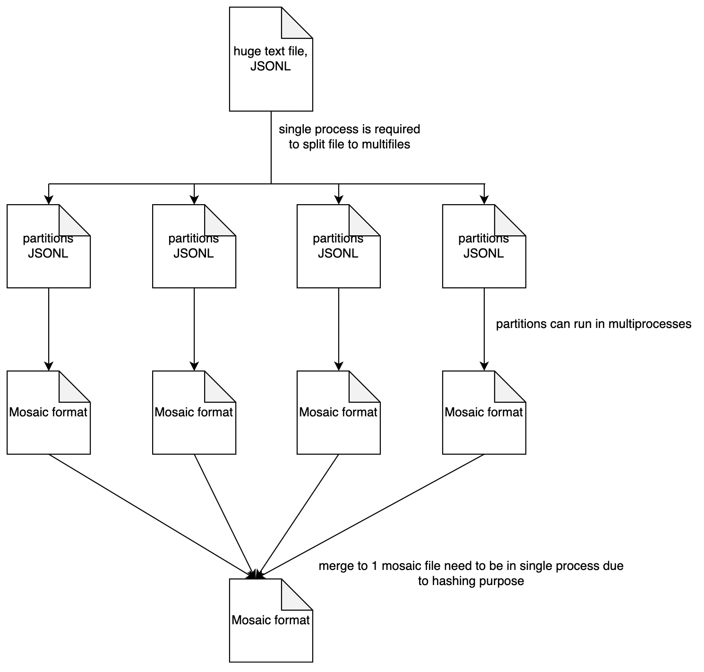

# Pretrain LLM

This is to pretrain 1B - 13B parameters LLM. All steps done using Standard_F48s_v2 node size.

## how-to not use HuggingFace datasets

It stream memory mapped file and after that concat, https://github.com/huggingface/datasets/blob/60bdf3005d1dc0b26da8e5949721b20d932eaad6/src/datasets/table.py#L51, super super slow, and you are wondering, is the script stuck? Yes, it is waiting for pyarrow streaming.

So we try our own approached,

https://drive.google.com/file/d/1dSQ7KQs_x7aCTNVXgMESIqTwEoAZt-OK/view?usp=sharing

1. Split JSONL file into smaller JSONL files.
2. Each smaller JSONL files run in multiprocessing to convert into Mosaic format.
3. Merge smaller Mosaic files into one Mosaic file.

## total tokens

1. [prepare-dedup-text-dataset-4096.ipynb](prepare-dedup-text-dataset-4096.ipynb), 31702310912
2. [prepare-starcoder-4096.ipynb](prepare-starcoder-4096.ipynb), 40981254144
3. [prepare-madlad-400-4096.ipynb](prepare-madlad-400-4096.ipynb), 14983720960
4. [prepare-instructions.ipynb](prepare-instructions.ipynb), 1577877504
5. [prepare-extra.ipynb](prepare-extra.ipynb), 1140461568

Total, 90B tokens, we uploaded the dataset at https://huggingface.co/datasets/malaysia-ai/mosaic-combine-all, so you can use it directly with https://docs.mosaicml.com/projects/streaming/en/latest/index.html